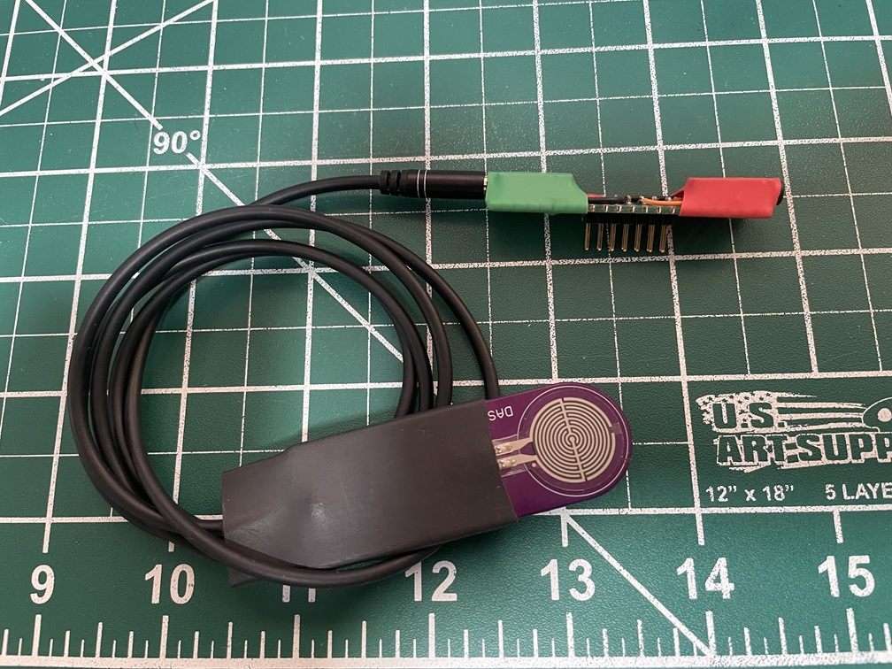

# Make an Adapter

* KeyIn: G13-Tip, G15-Ring - to paddle
* KeyOut: G3-Tip, G6-Ring - to radio
* Debug: G4-TX, G5-RX - not required for normal use



# Mini-CW User Manual

Mini-CW is a portable CW/Morse keyer and trainer for the M5 Cardputer ADV. The
current firmware has a working keyer plus LCWO-inspired trainer modes for
Lessons, Words, Callsigns, and Plain Text.

## Screen Layout

The display is a fixed 240 x 135 text UI:

```text
Top row: current mode
Green separator
6 content rows, 20 characters each
```

The last content row is often used as a compact status or command hint.

## Main Controls

```text
Opt       open/close mode select
Ctrl      open/close settings for the current mode
Enter     start or submit in trainer modes
Backspace edit typed copy
`         abort current trainer run, or stop playback/keyer activity
```

Settings screens use numbered rows. Press the row number to edit a value, type
digits or use `,` and `/` to decrease/increase, then press Enter to apply.
Backtick cancels an edit.

## Modes

Mode select currently shows:

```text
1 Keyer
2 Lessons
3 Words
4 Calls
5 Plain
6 System
```

### Keyer

Keyer mode starts on boot. Paddle and straight-key input are handled by
`keyer_service`. Keyboard letters and digits are sent as CW through the trainer
helper path.

Keyer shortcuts:

```text
+ or =    raise keyer WPM
-         lower keyer WPM
]         raise sidetone pitch
[         lower sidetone pitch
```

### Lessons

Lessons mode is Koch-style receive practice. It generates random copy from the
active lesson character set, sends it at the configured code/effective speed,
and scores typed copy when submitted.

Settings:

```text
1 Lesson      1..40
2 Duration    1..5 minutes
3 Code WPM    5..40
4 Eff WPM     5..40, clamped to Code WPM
5 Group       Rand, or 2..7 characters
```

### Words

Words mode runs 25-word adaptive attempts from a built-in English word bank.
Correct answers raise WPM, wrong answers lower WPM, and the result tracks score,
max WPM, best score, and best max WPM.

Controls:

```text
Enter     start/check answer
.         replay current word
Backspace edit answer
`         abort
```

Settings:

```text
1 Speed      5..40
2 MinChar    5..40
3 Lesson     9..40
4 MaxLen     2..15
```

### Calls

Calls mode runs 25-callsign adaptive attempts from a prototype built-in bank.
It accepts letters, digits, and `/`. Correct answers raise WPM up to MaxWPM;
wrong answers lower WPM.

Controls:

```text
Enter      start/check answer
. or Space replay current callsign
Backspace  edit answer
`          abort
```

Settings:

```text
1 Speed      5..40
2 MinChar    5..40
3 MaxWPM     5..40
```

### Plain

Plain mode sends one randomly selected built-in plain-text message, accepts
typed copy, and scores the result with Levenshtein accuracy after whitespace
normalization.

Unlike Words and Calls, period is typed punctuation in Plain mode.

Settings:

```text
1 Code WPM   5..40
2 Eff WPM    5..40, clamped to Code WPM
```

### System

System mode contains device-wide settings and actions.

```text
1 Volume
2 KeyIn
3 KeyIn WPM
4 Sleep/Batt
5 Date
6 Time
```

`KeyIn` cycles through the available input modes, including paddle,
reverse-paddle, straight-key, and mono straight-key modes.

## KeyIn Modes

```text
Paddle    G13/Tip = dit, G15/Ring = dah
PaddleR   G13/Tip = dah, G15/Ring = dit
SK        G13/Tip = straight key input
SK-Mono   G13/Tip or G15/Ring = straight key input
```

## Current Data And Persistence

Lessons, Words, Calls, and Plain currently use firmware-generated or
firmware-built-in practice data. The storage API has load/save stubs for
trainer config and results, but real FATFS-backed persistence is not enabled
yet.

## Current Limitations

```text
No file-backed word/callsign/plaintext lists yet
No user-editable setting.txt persistence yet
No USB flash-drive mode yet
No CW decoder display yet
No QSO/logging/statistics mode yet
Callsign bank is prototype data and will be replaced or generated later
```
