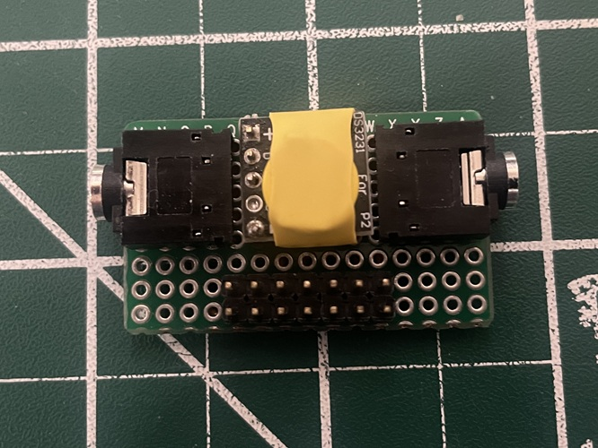
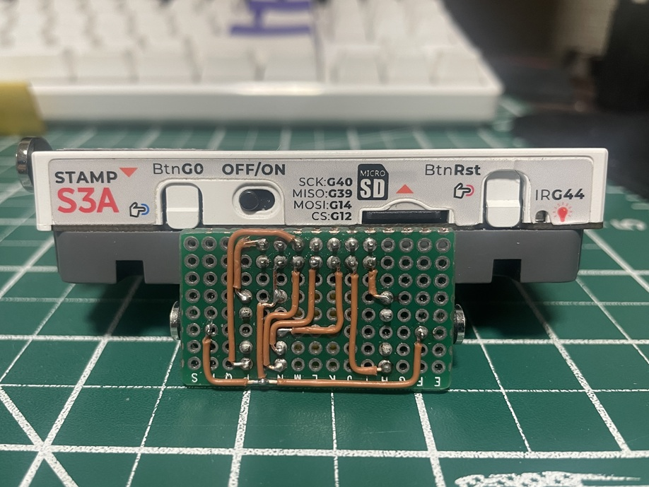

Subscribe to [https://freelists.org/list/qrp-portable](https://freelists.org/list/qrp-portable) for announcements, discussions, and updates about my Mini-series apps for the Cardputer ADV.

# Make an Adapter

* KeyIn: G13-Tip, G15-Ring - to paddle
* KeyOut: G3-Tip, G6-Ring - to radio
* RTC: G8-SDA, G9-SCL - Optional, DS3231 or similar
* Debug: G4-TX, G5-RX - not required for normal use




Audio phonejack: https://www.amazon.com/dp/B07MFKKWG5

RTC: https://www.amazon.com/dp/B01N1LZSK3

While in place, the adapter doubles as a stand, put Cardputer into a better viewing angle.

# Mini-CW User Manual

Mini-CW is a portable CW/Morse keyer and trainer for the M5 Cardputer ADV. The
current firmware has a working keyer plus LCWO-inspired trainer modes for
Lessons, Words, Callsigns, and Plain Text.

# Screen Layout

The display is a fixed 240 x 135 text UI:

```text
Top row: current mode
Green separator
6 content rows, 20 characters each
```

The last content row is often used as a compact status or command hint.

# Main Controls

```text
Opt       open/close mode select
Ctrl      open/close settings for the current mode
Enter     start or submit in trainer modes
Backspace edit typed copy
`         abort current trainer run, or stop playback/keyer activity
```

Settings screens use numbered rows. Press the row number to edit a value, type
digits or use `,` and `/` to decrease/increase, then press Enter to apply.
Text fields store typed letters as uppercase; use Fn+`,` and Fn+`/` to move the
text cursor left/right while editing. The edit cursor is shown as `_`. Fn+`;`
and Fn+`.` remain available for up/down navigation behavior. Backtick cancels an
edit.

# Modes

Mode select currently shows:

```text
1 Keyer
2 Lessons
3 Words
4 Calls
5 Plain
6 System
```

## Keyer

Keyer mode starts on boot. Keyboard CW characters typed on the Cardputer and M1-M5 message
memories append into one TX FIFO on line 6. TX starts after `txDelay`, or immediately with Enter.

The Keyer top row is a fixed 20-character white status line:

```text
Keyer [keyIn] [keyOut] [WPM]
```

In paddle modes, `WPM` is the KeyIn WPM. In straight-key modes, `WPM` is the
active adaptive `SK Wpm`.

If Keyer OP lookup has a current match, the top row switches to:

```text
Keyer [name:11] [WPM]
```

Lines 1-5 show decoded key input history in green. Line 6 shows the remaining TX
FIFO tail, selected status text such as `Mute:ON`, or Tune state. Sent
characters are removed from the display after they complete.

### Keyer shortcuts:

```text
Tab       enter/exit Tune mode
Alt       toggle M1-M5 shortcut overlay
1..5      select/send M1-M5 while Alt overlay is active
]         raise keyer WPM
[         lower keyer WPM
\         toggle Keyer Mute ON/OFF
Enter     start pending TX FIFO now
Backspace edit the unsent FIFO tail
Hold Backspace clear decoded history and TX FIFO
`         cancel current TX/playback
```

Mute suppresses sidetone only; it does not disable keyOut. 

### Keyer OP lookup
Keyer OP lookup reads `/fatfs/qsocalls.csv`. The CSV is `call,name`, with pre-normalized
uppercase calls up to 6 characters and names up to 11 characters:

```text
KG6YJ,JUN
N6HAN,HAN
```

Callsign-like decoded, typed, or message text can update the displayed OP name;
unmatched calls leave the current name unchanged. `mycall` is ignored. `73`,
`7 3`, `72`, or `7 2` clears the displayed OP name.

### Tune
Press Tab from the Keyer main page to enter or exit it. In Tune mode, paddle tip or ring true-holds tune output through the
current keyOut mode. Press `T` to start latched tune; press `T` again, press Tab,
press the paddle, or wait for `TuneTimeout` to stop it. `TuneTimeout:0` disables
the automatic timeout. Other keyboard keys are ignored while Tune is active.

### Keyer settings:

```text
Page 1
1 Vol       0..99
2 Mute      ON/OFF, volatile and resets OFF on boot
3 Wpm       5..60
4 Tone      300..999 Hz
5 keyIn     Pdl, Pdl-R, SK-T, SK-R
6 keyOut    Pdl, Pdl-R, SK, SK-M, OFF

Page 2
1 M1        CQ POTA
2 M2
3 M3
4 M4
5 M5
6 RepeatInt 1..99 seconds, used by repeating M1

Page 3
1 Paddle    IambicA, IambicB, Bug
2 txDelay   0..99 seconds
3 TuneTimeout 0..20 seconds, 0 means no timeout
4 myCall    AG6AQ (optional, exclude myCall from OP lookup)
5 SK Wpm    5..60, straight-key decoder seed/adaptive saved speed
```

M1 repeats at `RepeatInt` after the FIFO drains. Keyboard input or selecting
M2-M5 cancels M1 repeat. M2-M5 are one-shot. A paddle or straight-key press
cancels active or queued message/TX FIFO content.

## Lessons

Lessons mode is Koch-style receive practice. It generates random copy from the
active lesson character set, sends it at the configured code/effective speed,
and scores typed copy when submitted.

Settings:

```text
1 Lesson      1..40
2 Duration    1..5 minutes
3 Code WPM    5..40
4 Eff WPM     5..40, clamped to Code WPM
5 Group       Rand, or 2..7 characters
```

## Words

Words mode runs 25-word adaptive attempts from a built-in English word bank.
Correct answers raise WPM, wrong answers lower WPM, and the result tracks score,
max WPM, best score, and best max WPM.

Controls:

```text
Enter     start/check answer
.         replay current word
Backspace edit answer
`         abort
```

Settings:

```text
1 Speed      5..40
2 MinChar    5..40
3 Lesson     9..40
4 MaxLen     2..15
5 MaxWPM     5..40
6 Delay_s    0..5 seconds
```

## Calls

Calls mode runs 25-callsign adaptive attempts from a prototype built-in bank.
It accepts letters, digits, and `/`. Correct answers raise WPM up to MaxWPM;
wrong answers lower WPM.

Controls:

```text
Enter      start/check answer
. or Space replay current callsign
Backspace  edit answer
`          abort
```

Settings:

```text
1 Speed      5..40
2 MinChar    5..40
3 MaxWPM     5..40
4 Delay_s    0..5 seconds
```

## Plain

Plain mode sends one randomly selected built-in plain-text message, accepts
typed copy, and scores the result with Levenshtein accuracy after whitespace
normalization.

Unlike Words and Calls, period is typed punctuation in Plain mode.

Settings:

```text
1 Code WPM   5..40
2 Eff WPM    5..40, clamped to Code WPM
```

## System

System mode contains device-wide settings and actions.

```text
1 Volume
2 KeyIn
3 KeyIn WPM
4 Sleep/Batt
5 USB Drive
6 Tone
```

`KeyIn` cycles through the available input modes, including paddle,
reverse-paddle, and straight-key modes. `USB Drive` exposes the FATFS settings
volume to a PC; eject safely, then turn USB Drive OFF or reboot so firmware can
mount the filesystem again.

## KeyIn Modes

```text
Pdl       G13/Tip = dit, G15/Ring = dah
Pdl-R     G13/Tip = dah, G15/Ring = dit
SK-T      G13/Tip straight key input, ignore ring
SK-R      G15/Ring straight key input, ignore tip
```

Straight-key decoding starts from saved `SK Wpm`, adapts to measured key-down
durations, and saves the adapted speed only after it remains stable for about 2
minutes of straight-key use.

## KeyOut Modes

KeyOut uses active-low open-drain outputs: G3 is tip and G6 is ring.

```text
Pdl       dit to G3/Tip, dah to G6/Ring
Pdl-R     dit to G6/Ring, dah to G3/Tip
SK        key both G3/Tip and G6/Ring
SK-M      key G3/Tip and hold G6/Ring low for MTR
OFF       disable keyOut GPIO activity
```

## Data And Persistence

Lessons, Words, Calls, and Plain currently use firmware-generated or
firmware-built-in practice data.

Settings are saved in FATFS as `/fatfs/setting.txt`. Saved settings include
system volume/tone/keyIn/WPM; Keyer keyOut, paddle, SK Wpm, txDelay,
TuneTimeout, RepeatInt, mycall, and M1-M5; and trainer mode configuration. Keyer Mute is
intentionally not persisted.

Keyer OP lookup data is read from `/fatfs/qsocalls.csv`. If the file is missing,
firmware creates a header-only `call,name` file; existing user-managed lookup
files are not overwritten.

Mini-CW uses the shared Mini 8 MB partition layout: one factory app partition
from `0x10000` to `0x500000`, and a 3 MB FATFS partition from `0x500000` to
`0x800000`. FATFS uses 512-byte FATFS/WL sectors for USB MSC compatibility.
FATFS survives normal app reflashes that use this same table, but not
`erase_flash`, full-chip erase, or another partition layout change. Moving from
the older `0x400000` FATFS layout may cause a one-time FATFS reformat on first
boot.

The build generates `build/fatfs.bin` from `fatfs_image/` and
`build/MiniCW_V1_1_Merged_Auto.bin` for factory/release flashing. Normal
`idf.py flash` does not write `fatfs.bin`, so existing FATFS files survive. The
merged release binary includes the seed FATFS image and overwrites
`setting.txt` and `qsocalls.csv`.

The release package can contain `MiniCW_V1_1.bin` and `flash_mini_cw.ps1` in the
same directory. The flash script defaults to COM11 and loads `MiniCW_V1_1.bin`
from its own directory.

## Current Limitations

```text
No file-backed word/callsign/plaintext lists yet
Trainer result persistence is not enabled yet
No QSO/logging/statistics mode yet
Callsign bank is prototype data and will be replaced or generated later
```
